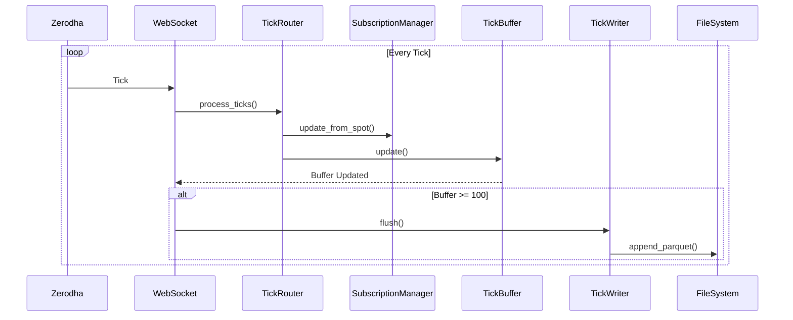

```mermaid
sequenceDiagram

participant Zerodha
participant WebSocket
participant TickRouter
participant SubscriptionManager
participant TickBuffer
participant TickWriter
participant FileSystem

loop Every Tick

Zerodha->>WebSocket: Tick

WebSocket->>TickRouter: process_ticks()

TickRouter->>SubscriptionManager: update_from_spot()

TickRouter->>TickBuffer: update()

TickBuffer-->>WebSocket: Buffer Updated

alt Buffer >= 100

WebSocket->>TickWriter: flush()

TickWriter->>FileSystem: append_parquet()

end

end
```