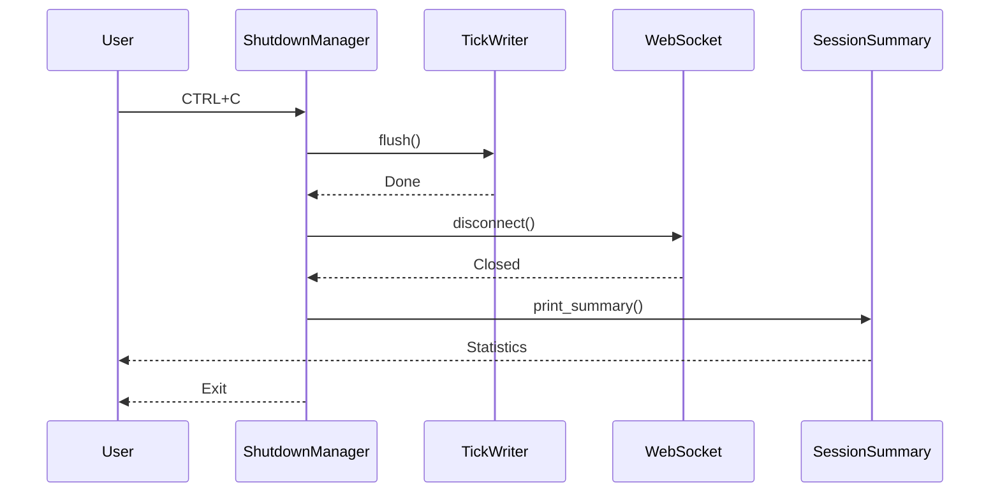

```mermaid
sequenceDiagram

participant User
participant ShutdownManager
participant TickWriter
participant WebSocket
participant SessionSummary

User->>ShutdownManager: CTRL+C

ShutdownManager->>TickWriter: flush()

TickWriter-->>ShutdownManager: Done

ShutdownManager->>WebSocket: disconnect()

WebSocket-->>ShutdownManager: Closed

ShutdownManager->>SessionSummary: print_summary()

SessionSummary-->>User: Statistics

ShutdownManager-->>User: Exit
```