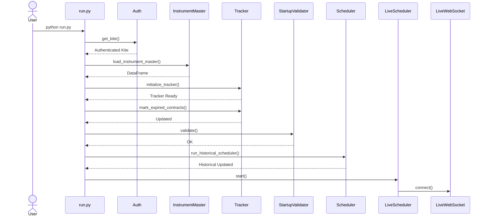

```mermaid
sequenceDiagram

actor User

participant Run as run.py
participant Auth
participant InstrumentMaster
participant Tracker
participant StartupValidator
participant Scheduler
participant LiveScheduler
participant LiveWebSocket

User->>Run: python run.py

Run->>Auth: get_kite()

Auth-->>Run: Authenticated Kite

Run->>InstrumentMaster: load_instrument_master()

InstrumentMaster-->>Run: DataFrame

Run->>Tracker: initialize_tracker()

Tracker-->>Run: Tracker Ready

Run->>Tracker: mark_expired_contracts()

Tracker-->>Run: Updated

Run->>StartupValidator: validate()

StartupValidator-->>Run: OK

Run->>Scheduler: run_historical_scheduler()

Scheduler-->>Run: Historical Updated

Run->>LiveScheduler: start()

LiveScheduler->>LiveWebSocket: connect()
```